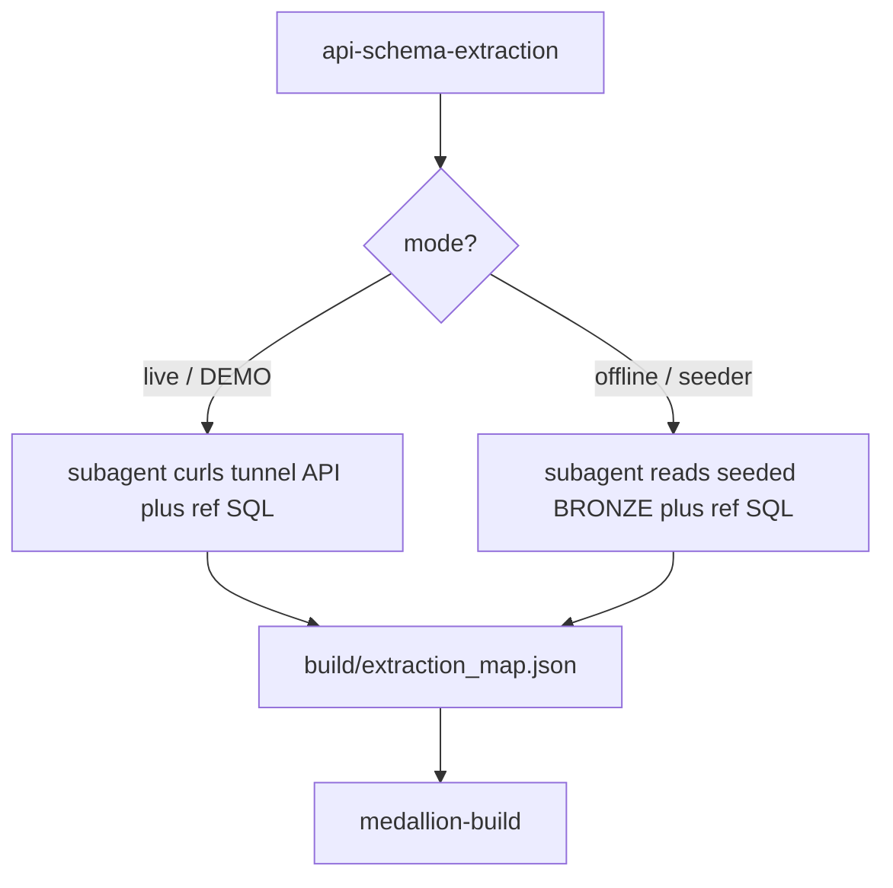

# Plan: Dedicated extraction subagent + de-hardcoded connection

## Context (what I explored)
- **No agent/plugin mechanism exists** in this repo: `glob` found no `agents/`, no `plugin.json`/manifest. Skills are `SKILL.md` files with an *advisory* `tools:` block (project memory confirms `tools:` is not a hard gate). So a "dedicated subagent" is implemented as: the skill **mandates** delegating the map build to a `Task` subagent (`generalPurpose`), driven by a **fixed reusable prompt** kept in the skill's `references/`. This is exactly the pattern that worked this session (I spawned a subagent for the 261-column map) — the change makes it deterministic instead of ad-hoc.
- **Two viable offline map sources** (no tunnel): the **seeded Bronze VARIANT** (`SELECT PAYLOAD FROM BRONZE.<t> LIMIT 1` — real JSON shape) cross-referenced with `src/02_bronze.sql` (registry) + `src/03_silver.sql` (exact columns/types + `SILVER_FIELD_MAP` nested paths); and `examples/hris_people/schema_spec.json` (`api_field` = json_path). Note `schema_spec.json` is a *lineage reference* (row counts/paths differ slightly, e.g. `reporting_manager.system_id`), so the seeded Bronze + `src/03` is the more authoritative offline source.
- **Connection is hardcoded in 22 files** and doubles as the *path selector* (`sevenpeaks_partner_demo` => live DEMO; `7ptrial` => offline). `connections.toml` sets `default_connection_name = "naphob-coco"` (key-pair JWT), so `snow` with no `-c` uses the user's default — the clean target.
- Only one file has a *functional* hardcoded default: [.cortex/hooks/verify_medallion.sh](.cortex/hooks/verify_medallion.sh) line 13 `CONN="${CORTEX_DEMO_CONN:-sevenpeaks_partner_demo}"`.

## Design decisions (baked in — edit if you disagree)
1. **Dedicated extraction subagent, dual-mode.** `api-schema-extraction` ALWAYS delegates to a `Task` subagent. The subagent takes a `mode`:
   - **live** (DEMO): `BASE=<tunnel url>` given -> curl `/openapi.json` + a sample page per endpoint (+ reference SQL) -> `build/extraction_map.json` (`extracted_from: <url>`).
   - **offline** (seeder/trial): no tunnel; Bronze already seeded -> `SELECT PAYLOAD FROM BRONZE.<t>` per table (+ `src/02`/`src/03` and/or `schema_spec.json`) -> identical `build/extraction_map.json` (`extracted_from: "offline: seeded BRONZE + src reference"`).
   Both produce the same JSON shape and hand off to `medallion-build`.
2. **Connection is never a specific account.** SQL Cortex Code runs -> the **active** connection (no name). `snow` CLI in docs/scripts -> the user's **default** connection, shown as `<your-connection>`. Path selection (live vs offline) keys off **capability** (can create an EAI + reach the mock API?) and an explicit `ask_user_question`, not the connection name. The two-path framing stays; only the dependence on the *names* `sevenpeaks_partner_demo`/`7ptrial` is removed.
3. **verify_medallion.sh**: drop the hardcoded fallback; when `CORTEX_DEMO_CONN` is unset, omit `-c` so `snow` uses the user's default connection (per your "proceed accordingly").

## Implementation steps

### 1. Dedicated extraction subagent (the core new piece)
- New file `.snowflake/cortex/skills/api-schema-extraction/references/extraction_subagent.md`: the fixed, reusable subagent prompt template with a `MODE` switch (live vs offline), the exact source list per mode, the output JSON contract, and the "report back" checklist.
- Rewrite [.snowflake/cortex/skills/api-schema-extraction/SKILL.md](.snowflake/cortex/skills/api-schema-extraction/SKILL.md):
  - Frontmatter `description`: works on BOTH the live API path and the offline seeder path; drop "DEMO (live mock_api) path" exclusivity and the `sevenpeaks_partner_demo` mention. Add the subagent/`task` tool to `tools:` (documentation).
  - When-to-Use: both paths; remove "The 7ptrial path skips this skill entirely."
  - New mandatory workflow "0. Delegate to the extraction subagent" pointing at the reference prompt; keep the field-mapping rules as the subagent's spec.
  - Add the offline-mode source instructions (seeded Bronze VARIANT + `src/02`/`03` + `schema_spec.json`).

### 2. Reconcile the offline path to USE api-schema-extraction
- [.snowflake/cortex/skills/trial-seed-bronze/SKILL.md](.snowflake/cortex/skills/trial-seed-bronze/SKILL.md): in the "optional reviewed build" (step 3) and intro, replace "no `api-schema-extraction`" wording with: after seeding Bronze, run `api-schema-extraction` in **offline mode** (its dedicated subagent derives the map from seeded Bronze / `schema_spec.json`), then `medallion-build` for Silver+Gold. Replace `7ptrial` connection references with "your trial/offline connection" / `<your-connection>`.
- [.snowflake/cortex/skills/medallion-build/SKILL.md](.snowflake/cortex/skills/medallion-build/SKILL.md) "Trial / offline mode": change "Get the map offline (no `api-schema-extraction`)" to "run `api-schema-extraction` in offline mode." Also de-hardcode line 12/154 connection text.

### 3. De-hardcode connection in agent instructions + remaining skills
- [AGENTS.md](AGENTS.md): two-path table + text -> describe paths by *capability*, add "run SQL on the active connection; `snow` CLI uses your default connection (`<your-connection>`)."
- Remaining skills + references: `cortex-analyst-search/SKILL.md` + `references/semantic_and_search.md`; `dashboard-compose/SKILL.md` (lines 13,62,101) + `references/deploy_verify.md`; `medallion-build/references/layer_patterns.md`; `trial-seed-bronze/references/seeder_profiles.md` -> replace `sevenpeaks_partner_demo`/`7ptrial`/`-c <name>` with `<your-connection>`/active-connection wording.

### 4. Sync ALL corresponding markdown docs (your point 3)
Update every doc that describes the extraction step or the connection so nothing contradicts the new behavior:
- [README.md](README.md) (lines 29,52), [examples/hris_people/deployed_app/README.md](examples/hris_people/deployed_app/README.md) (37,77,81), [examples/hris_people/deployed_app/src/README.md](examples/hris_people/deployed_app/src/README.md) (31,41,46,49,52,53), [examples/hris_people/deployed_app/src/seeders/README.md](examples/hris_people/deployed_app/src/seeders/README.md), [examples/hris_people/deployed_app/mock_api/README.md](examples/hris_people/deployed_app/mock_api/README.md), [.cortex/hooks/README.md](.cortex/hooks/README.md) (24).
- `api-schema-extraction/references/field_path_extraction.md` and any reference that says "DEMO only" -> note it now covers both modes.
- Local-only docs kept in sync too: [CLAUDE.md](CLAUDE.md) and `docs/WORKSHOP.md` (git-ignored per memory, but the presenter's local copy should match).
- Where README tables document the two paths, keep the DEMO vs offline distinction but rename the "Connection" column to describe capability + `<your-connection>`, and note the DEMO path now also always uses the extraction subagent.

### 5. Fix the one functional default + verify scripts
- [.cortex/hooks/verify_medallion.sh](.cortex/hooks/verify_medallion.sh): `CONN` -> when `CORTEX_DEMO_CONN` unset, omit `-c` (use snow default); no hardcoded account. Update its usage comment and [.cortex/hooks/README.md](.cortex/hooks/README.md).
- Confirm (read-only, adjust text only if needed): `mock_api/serve_eai.sh` (`CONN` already `<your-connection>` from gitignored `.tunnel.env` — leave logic), `src/seeders/seed_bronze.sh` / `seed_bronze.py` (`--connection` required, no hardcoded default — keep; only fix help/placeholder text).

## Verification
- `grep -rn "sevenpeaks_partner_demo" .` -> zero matches outside gitignored files (`.tunnel.env`).
- Remaining `7ptrial` matches only where the offline path is *named as an example*, phrased as "your trial connection," never a required account.
- `python3 tools/lint_skill.py .snowflake/cortex/skills/api-schema-extraction/SKILL.md` (and the other 4 skills) pass — including the new `references/extraction_subagent.md` being referenced.
- Manual read-through: `api-schema-extraction/SKILL.md` clearly (a) always delegates to the subagent and (b) documents both modes; `trial-seed-bronze` + `medallion-build` offline mode now point to it; `AGENTS.md` tells Cortex Code to use the active/default connection and to ask (not infer) the path.

## Critical files
- [.snowflake/cortex/skills/api-schema-extraction/SKILL.md](.snowflake/cortex/skills/api-schema-extraction/SKILL.md) - core rewrite: dual-mode + mandatory subagent delegation.
- `.snowflake/cortex/skills/api-schema-extraction/references/extraction_subagent.md` - NEW: the dedicated subagent's reusable prompt (both modes).
- [AGENTS.md](AGENTS.md) - drives Cortex Code: active/default connection + capability-based path selection.
- [.snowflake/cortex/skills/trial-seed-bronze/SKILL.md](.snowflake/cortex/skills/trial-seed-bronze/SKILL.md) and [.snowflake/cortex/skills/medallion-build/SKILL.md](.snowflake/cortex/skills/medallion-build/SKILL.md) - reconcile offline path to use the extraction subagent.
- [.cortex/hooks/verify_medallion.sh](.cortex/hooks/verify_medallion.sh) - the only functional hardcoded connection default.

## Open question
"Dedicated subagent" implemented as a **skill-mandated `Task` subagent + reusable prompt in `references/`** (fits this repo, no agent framework exists). If you actually want a standalone agent artifact/persona file, say so and I'll add that instead — but nothing in Cortex Code would auto-wire it here, so the skill-driven approach is what runs deterministically.
